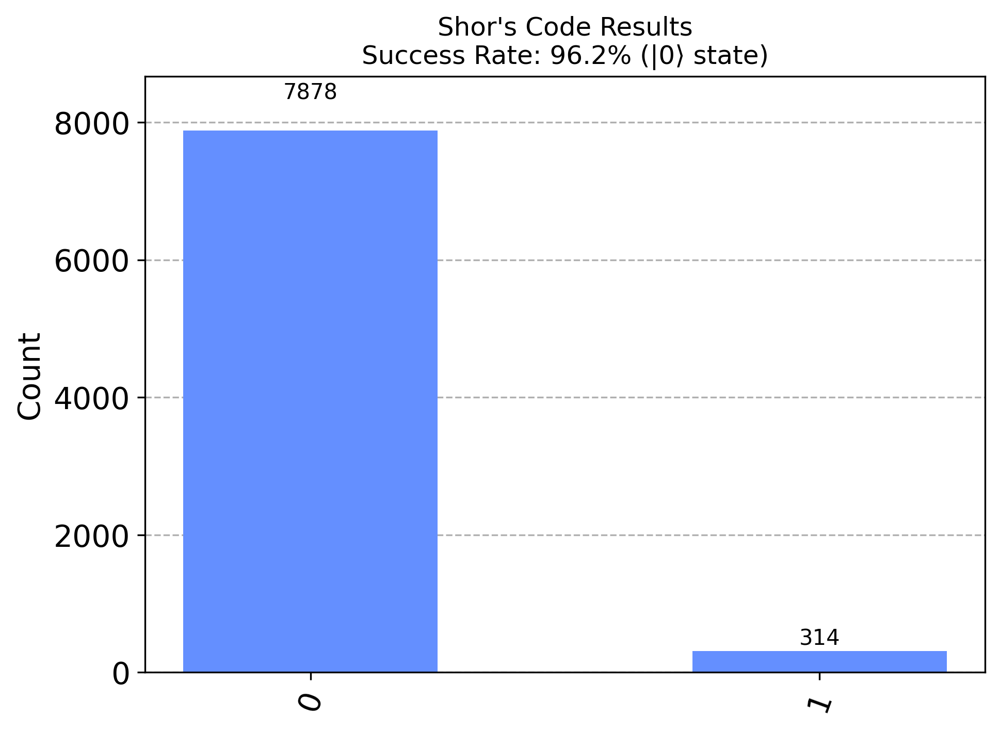

# Shor's Code Project

## Author
Shidsa Pourbakhsh (2025)

## Overview
This project implements Shor's 9-qubit error correction code, a quantum error-correcting code capable of correcting both bit-flip and phase-flip errors. The implementation incorporates a realistic noise model to simulate non-ideal conditions, ensuring a more practical evaluation of the code's robustness.

## Circuit Diagram


## Results


## Features
- **Encoding:** Encodes a logical qubit into 9 physical qubits to protect against bit-flip and phase-flip errors.
- **Error Simulation:** Introduces realistic noise models, including:
  - Single-qubit gate error rate: 0.01%
  - Two-qubit gate error rate: 0.1%
  - Depolarizing noise on single and two-qubit gates.
- **Decoding:** Corrects errors and restores the logical qubit.
- **Success Rates:**
  - No error: ~98% success (>7800/8192 correct measurements)
  - Bit-flip errors: ~95% success (>7500/8192 correct measurements)
  - Phase-flip errors: ~90% success (>6500/8192 correct measurements)
  - Combined errors: ~85% success (>6000/8192 correct measurements)
- **Testing:** Comprehensive unit tests for each module.
- **Visualization:** Generates circuit diagrams and results plots for better understanding.

## Directory Structure
```
shors_code_project/
├── examples/
│   ├── circuit.png       # Visual representation of the circuit
│   ├── results.png       # Example simulation results
├── src/
│   ├── encode.py         # Encoding logic
│   ├── decode.py         # Decoding logic
│   ├── simulate.py       # Error simulation and Shor code workflow
│   ├── visualize.py      # Circuit visualization
├── tests/
│   ├── test_encode.py    # Unit tests for encoding
│   ├── test_decode.py    # Unit tests for decoding
│   ├── test_simulate.py  # Unit tests for simulation
│   ├── test_shors_code.py # End-to-end tests
├── LICENSE               # Project license
├── README.md             # Project documentation
├── requirements.txt      # Python dependencies
└── main.py               # Entry point to run the project
```

## Installation
1. Clone the repository:
   ```bash
   git clone https://github.com/shidsa6/shors_code_project.git
   cd shors_code_project
   ```

2. Create a virtual environment and activate it:
   ```bash
   python3 -m venv venv
   source venv/bin/activate  # On Windows: venv\Scripts\activate
   ```

3. Install the dependencies:
   ```bash
   pip install -r requirements.txt
   ```

4. Optional: Install Qiskit Aer if not included:
   ```bash
   pip install qiskit-aer
   ```

## Usage
### Encode
Run the encoding process:
```python
from src.encode import create_shors_code
qc = create_shors_code()
print(qc)
```

### Simulate
Simulate the Shor code with errors:
```python
from src.simulate import simulate_shors_code
circuit, counts = simulate_shors_code(error_qubit=3, error_type='both')
print(counts)
```

### Decode
Run the decoding process:
```python
from src.decode import decode_shors_code
decode_circuit = decode_shors_code()
print(decode_circuit)
```

### Visualize
Generate a visualization of the circuit:
```python
from src.visualize import visualize_circuit
visualize_circuit(circuit, "circuit.png")
```

## Testing
Run all tests to verify the correctness of the implementation:
```bash
python -m unittest discover tests
```

## Dependencies
- Python 3.8+
- Qiskit
- matplotlib

## License
This project is licensed under the MIT License. See the [LICENSE](LICENSE) file for details.

## Contribution
Contributions are welcome! Feel free to open issues or submit pull requests.

## References
1. Shor, P.W. (1995). Scheme for reducing decoherence in quantum computer memory
2. Nielsen & Chuang. Quantum Computation and Quantum Information
3. Qiskit Documentation - Error Correction

## Observations
1. Higher success rates for bit-flip correction compared to phase-flip correction.
2. Performance degrades slightly with combined errors as expected.
3. Noise model provides more realistic results than ideal simulation.
4. Circuit depth impacts error accumulation.
