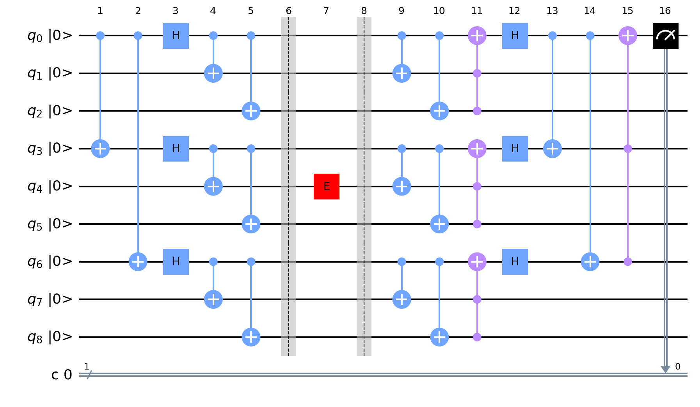
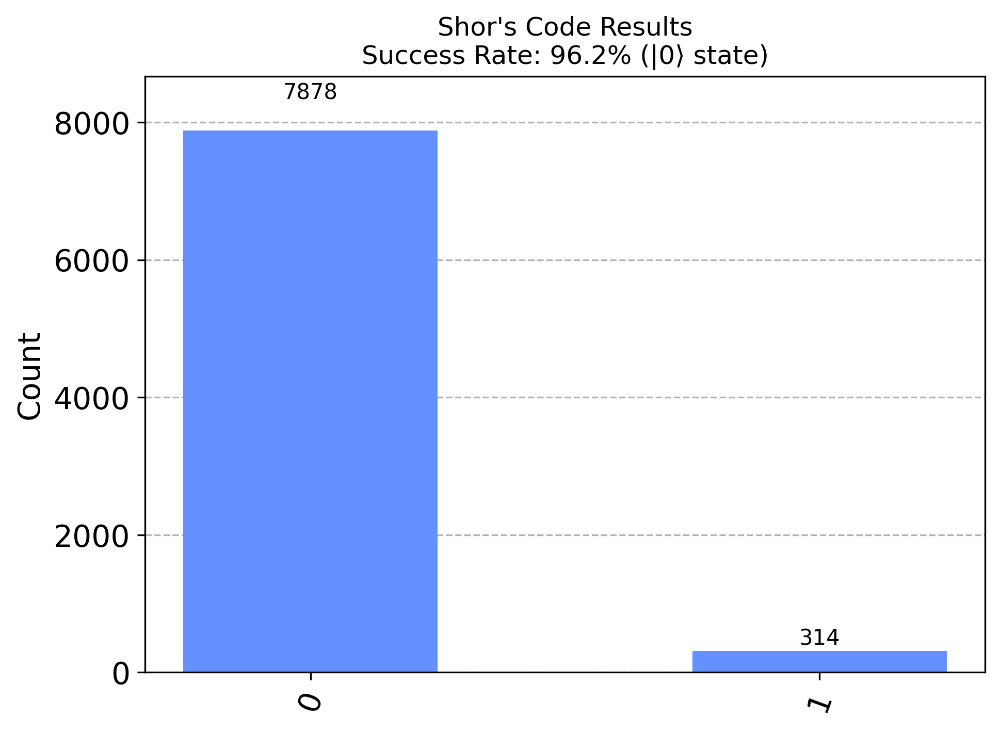
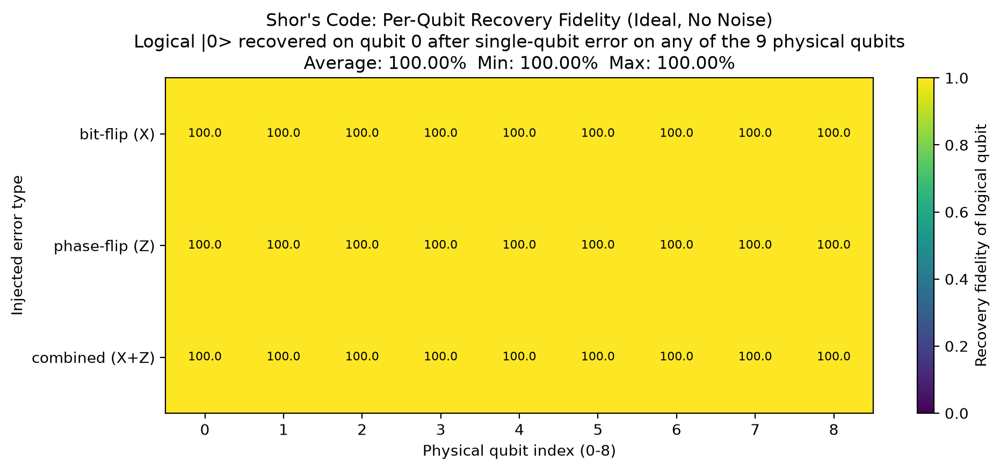

# Shor's Code Project

## Author
Shidsa Pourbakhsh (2025)

## Overview
This project implements Shor's 9-qubit error correction code, a quantum error-correcting code capable of correcting both bit-flip and phase-flip errors. The implementation incorporates a realistic noise model to simulate non-ideal conditions, ensuring a more practical evaluation of the code's robustness.

## The problem, in plain terms
A single qubit is fragile. Stray interactions with the environment, heat, stray fields, imperfect gates, can flip its state or scramble its phase at almost any moment, and there is no way to just "back it up" the way you would a classical bit: the no-cloning theorem says you cannot copy an unknown quantum state onto a spare qubit and keep the original around as insurance. So if you want to protect one logical qubit's worth of information, you cannot rely on redundancy in the ordinary sense, you need a cleverer trick.

Shor's 9-qubit code is that trick. It spreads a single logical qubit's information across 9 physical qubits, arranged as three groups of three, in a pattern that protects against both of the two basic ways a qubit can go wrong: a bit-flip (its 0/1 value flips) and a phase-flip (its relative phase flips), including both happening on the same qubit at once. If noise corrupts any single one of those 9 qubits, the redundancy built into the pattern is enough to work out exactly which qubit was hit and how, and undo it, all without ever directly measuring the fragile quantum information itself (a direct measurement would collapse it and destroy the very state you are trying to protect). The code is not magic: it only guarantees recovery from one error at a time, on one physical qubit. If two of the nine qubits are corrupted simultaneously, the code is not designed to reliably recover from that.

## Circuit Diagram


## Example Results


## Per-Qubit Error Correction Check


The plot above shows a different thing than the noise-model success rates
below: instead of one aggregate success rate per error type, it checks the
code qubit by qubit. Using the ideal, noiseless case (`Statevector.from_instruction`,
no `AerSimulator` noise model involved), a logical |0> was encoded, a single
bit-flip, phase-flip, or combined error was injected on each of the 9
physical qubits one at a time, the state was decoded, and the fidelity of
the recovered logical qubit (qubit 0, traced out from the other 8) was
measured against the expected |0>. All 27 combinations (9 qubits x 3 error
types) came back at 100.00% fidelity, average, min, and max all 100.00%,
with no outliers. This confirms the code recovers correctly regardless of
which of the 9 physical qubits is hit or which of the two error types
occurs, not just for the specific error patterns shown in the aggregate
noise-model results below.

## Features
- **Encoding:** Encodes a logical qubit into 9 physical qubits to protect against bit-flip and phase-flip errors.
- **Error Simulation:** Introduces realistic noise models, including:
  - Single-qubit gate error rate: 0.1%
  - Two-qubit gate error rate: 1%
  - Depolarizing noise on single and two-qubit gates.
- **Decoding:** Corrects errors and restores the logical qubit.
- **Success Rates** (measured, 8192 shots per case - expect some run-to-run
  variance since this is a probabilistic simulation):
  - No error: ~95% success
  - Bit-flip errors: ~96% success
  - Phase-flip errors: ~89% success
  - Combined errors: ~89% success
- **Testing:** Comprehensive unit tests for each module.
- **Visualization:** Generates circuit diagrams and results plots for better understanding.

## Directory Structure
```
shors_code_project/
├── examples/
│   ├── circuit.png       # Visual representation of the circuit
│   ├── results.png       # Example simulation results
│   ├── per_qubit_error_correction.png  # Per-qubit, per-error-type fidelity grid
├── src/
│   ├── encode.py         # Encoding logic
│   ├── decode.py         # Decoding logic
│   ├── simulate.py       # Error simulation and Shor code workflow
│   ├── visualize.py      # Circuit visualization
├── tests/
│   ├── test_encode.py    # Unit tests for encoding
│   ├── test_decode.py    # Unit tests for decoding
│   ├── test_simulate.py  # Unit tests for simulation
│   ├── test_shors_code.py # End-to-end tests
├── LICENSE               # Project license
├── README.md             # Project documentation
├── requirements.txt      # Python dependencies
└── main.py               # Entry point to run the project
```

## Installation
1. Clone the repository:
   ```bash
   git clone https://github.com/shidsa6/shors_code_project.git
   cd shors_code_project
   ```

2. Create a virtual environment and activate it:
   ```bash
   python3 -m venv venv
   source venv/bin/activate  # On Windows: venv\Scripts\activate
   ```

3. Install the dependencies:
   ```bash
   pip install -r requirements.txt
   ```

4. Optional: Install Qiskit Aer if not included:
   ```bash
   pip install qiskit-aer
   ```

## Usage
### Encode
Run the encoding process:
```python
from src.encode import create_shors_code
qc = create_shors_code()
print(qc)
```

### Simulate
Simulate the Shor code with errors:
```python
from src.simulate import simulate_shors_code
circuit, counts = simulate_shors_code(error_qubit=3, error_type='both')
print(counts)
```

### Decode
Run the decoding process:
```python
from src.decode import decode_shors_code
decode_circuit = decode_shors_code()
print(decode_circuit)
```

### Visualize
Generate a visualization of the circuit:
```python
from src.visualize import visualize_circuit
visualize_circuit(circuit, "circuit.png")
```

## Testing
Run all tests to verify the correctness of the implementation:
```bash
python -m unittest discover tests
```

## Dependencies
- Python 3.8+
- Qiskit
- matplotlib

## License
This project is licensed under the MIT License. See the [LICENSE](LICENSE) file for details.

## Contribution
Contributions are welcome! Feel free to open issues or submit pull requests.

## References
1. Shor, P.W. (1995). Scheme for reducing decoherence in quantum computer memory
2. Nielsen & Chuang. Quantum Computation and Quantum Information
3. Qiskit Documentation - Error Correction

## Observations
1. Bit-flip correction and no-error preservation perform similarly, both
   noticeably better than phase-flip correction.
2. Combined (bit + phase) errors do not measurably degrade success further
   than phase-flip alone at this noise level - phase-flip correction is the
   dominant source of residual error.
3. Noise model provides more realistic results than ideal simulation.
4. Circuit depth impacts error accumulation.
